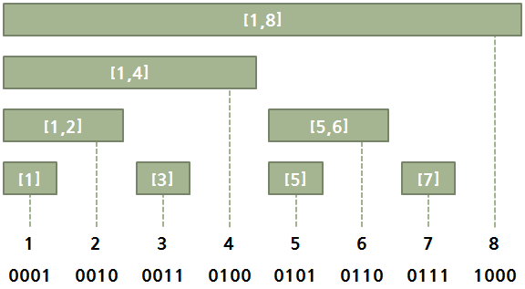
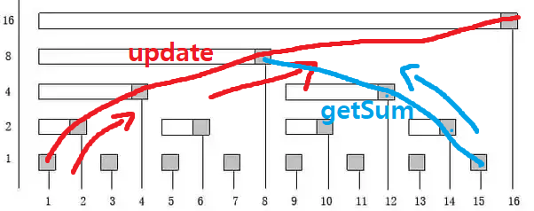

# Binary Indexed Tree (Fenwick Tree)

- [참조 1](https://secmem.tistory.com/486)
- [참조 5](https://www.youtube.com/watch?v=rHSCJ0v3fQ0)
- [참조 2](https://www.youtube.com/watch?v=gtU9NvsDuh8)
- [참조 3](https://www.youtube.com/watch?v=4SNzC4uNmTA)
- [참조 4](https://www.geeksforgeeks.org/binary-indexed-tree-or-fenwick-tree-2/)
- [참조 5](https://minusi.tistory.com/entry/%ED%8E%9C%EC%9C%85-%ED%8A%B8%EB%A6%ACFenwick-Tree-Binary-Indexed-Tree)

세그먼트 트리의 가장 흔한 사용 예는 구간 합을 빠르게 구하는 것이고,   
이 경우 세그먼트 트리 대신 쓸 수 있는 구간 트리의 궁극적인 진화 형태로  
`펜윅 트리(Fenwick Tree)` 혹은 `이진 인덱스 트리(Binary Indexed Tree)`라고 불립니다.

s부터 t까지의 합을 구하고자 할 때, 세그먼트 트리를 사용하면 직접적으로 구할 수 있습니다.  
하지만 합의 경우에는 `(1부터 t까지의 합) - (1부터 s-1까지의 합)`을 계산한다면, s부터 t까지의 합이 됩니다.   
따라서, 임의의 i에 대해서는 1부터 i까지의 합을 계산할 수 있다면 충분하다는 것을 알 수 있습니다.

> 이와 같은 조건을 제한한다면 세그먼트 트리의 오른쪽 방향으로 분기되어 있는 노드의 값이 필요 없어집니다.

이러한 방법을 기반으로 한 자료 구조가 Binary Indexed Tree 이며 세그먼트 트리보다 구현이 쉽고, 고속으로 동작합니다. 세그먼트 트리와 비교하여 이진 인덱스 트리는 공간이 덜 필요하고 구현하기
쉽습니다.

이진 인덱스 트리는 배열로 표시됩니다. 배열을 BITree []로 둡니다. 이진 인덱스 트리의 각 노드는 입력 배열의 일부 요소의 합계를 저장합니다. 이진 인덱스 트리의 크기는 n으로 표시되는 입력 배열의 크기와
같습니다. 아래 코드에서는 쉽게 구현할 수 있도록 n + 1 크기를 사용합니다.




### Last Set Bit 구하는 방법

어떤 수(K)의 last set bit 를 구하는 방법
> = K & (-K)

### Operation

### Update

인덱스 위치 변경

```text
index += 1; // fenwick tree 인덱스로 조정

Last Set Bit를 더해주면서 이동(우상향) 
index += index & (-index)
```

```text
update(x, val): Updates the Binary Indexed Tree (BIT) by performing arr[index] += val
// Note that the update(x, val) operation will not change arr[]. It only makes changes to BITree[]

1) Initialize the current index as x+1.

2) Do the following while the current index is smaller than or equal to n.
    a) Add the val to BITree[index]
    b) Go to parent of BITree[index]. 
       The parent can be obtained by incrementing the last set bit of the current index, 
       i.e., index = index + (index & (-index))
```


The update function needs to make sure that all the BITree nodes which contain arr[i] within their ranges being updated.
We loop over such nodes in the BITree by repeatedly adding the decimal number corresponding to the last set bit of the
current index.

### getSum

인덱스 위치 변경

```text
index += 1; // fenwick tree 인덱스로 조정

Last Set Bit를 빼주주면서 이동(좌상향) 
index -= index & (-index)
```

```text
getSum(x): Returns the sum of the sub-array arr[0,…,x]
// Returns the sum of the sub-array arr[0,…,x] using BITree[0..n], which is constructed from arr[0..n-1]

1) Initialize the output sum as 0, the current index as x+1.

2) Do following while the current index is greater than 0.
    a) Add BITree[index] to sum
    b) Go to the parent of BITree[index]. The parent can be obtained by removing
       the last set bit from the current index, i.e., index = index – (index & (-index))
       
3) Return sum.
```


The diagram above provides an example of how getSum() is working.   
Here are some important observations.

BITree[0] is a dummy node.  
BITree[y] is the parent of BITree[x],   
if and only if y can be obtained by removing the last set bit   
from the binary representation of x, that is y = x – (x & (-x)).

The child node BITree[x] of the node BITree[y] stores the sum of the elements   
between y(inclusive) and x(exclusive): arr[y,…,x).

### How does Binary Indexed Tree work?

The idea is based on the fact that all positive integers can be represented as the sum of powers of 2.  
이 아이디어는 모든 양의 정수가 2의 거듭 제곱의 합으로 표현 될 수 있다는 사실을 기반으로 합니다.

For example 19 can be represented as 16 + 2 + 1.

Every node of the BITree stores the sum of n elements where n is a power of 2.   
For example, in the first diagram above (the diagram for getSum()),   
the sum of the first 12 elements can be obtained by the sum of the last 4 elements (from 9 to 12) plus the sum of 8
elements (from 1 to 8).   
The number of set bits in the binary representation of a number n is O(Logn).

Therefore, we traverse at-most O(Logn) nodes in both getSum() and update() operations.   
The time complexity of the construction is O(nLogn) as it calls update() for all n elements.

### Can we extend the Binary Indexed Tree to computing the sum of a range in O(Logn) time?

Yes. rangeSum(l, r) = getSum(r) – getSum(l-1).

펜윅트리의 i번째 요소가 의미하는 것은 아래의 규칙에 따라서 결정됩니다 :

인덱스가 홀수이면, 원본 배열의 값이랑 동일하게 가집니다.

- data[2i + 1] = arr[2i + 1]
- data[1] = arr[1], data[3] = arr[3], data[5] = arr[5]...

인덱스가 2^k의 배수를 만족하면서 2^(k+1)을 만족하지 않을 때, 해당 인덱스는 자기 자신을 포함하여 직전의 2^k개의 값의 합을 저장합니다.

- data[12]는 2^2의 배수이면서 2^3의 배수가 아니므로 arr[9] + arr[10] + arr[11] + arr[12]의 값을 저장한다.


