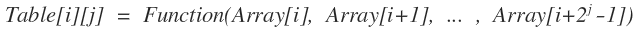
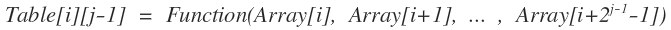
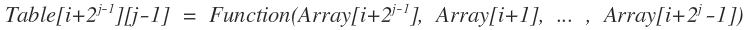
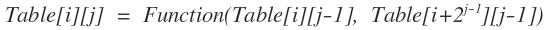
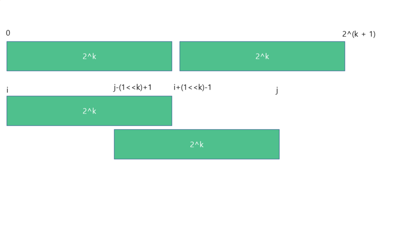

# Sparse Table

- https://www.geeksforgeeks.org/sparse-table/
- https://aruz.tistory.com/8
- https://www.weeklyps.com/entry/%EC%8A%A4%ED%8C%8C%EC%8A%A4-%ED%85%8C%EC%9D%B4%EB%B8%94-Sparse-table
- https://kimcodingvv.github.io/Sparse-Table/

## 마구잡이 키워드

정적 구간 질의를 처리할 수 있는 자료구조 전처리 후에는 값이 변경되면 안됨. O(logN) or O(1)

만약 중간에 배열 값이 변한다면 희소 테이블은 처음부터 다시 계산되어야 하기 때문입니다.

스파 스 테이블 개념은 정적 데이터 집합에 대한 빠른 쿼리에 사용됩니다 (요소는 변경되지 않음). 쿼리에 효율적으로 응답 할 수 있도록 전처리를 수행합니다.

전처리 O(NlogN), 쿼리 당 O(logN)

---

배열 Array[1...N], 함수 Function, 범위 [L, R] 이 주어질 때 Function(Array[L], Array[L+1], ..., Array[R]) 계산을 빠르게 하기 위한 자료구조

스파스 테이블은 아래의 두 조건이 성립할 때 사용할 수 있습니다.

조건 1) Array에 저장된 값이 변하지 않야야 한다.  
조건 2) Function은 결합 법칙이 성립해야 한다.  
(즉, F(a,b,c) = F(F(a,b),C) = F(a,F(b,c))가 성립해야 한다.)

---

대부분의 Array 와 Function에 대해, Sparse table 은 아래와 같이 정의할 수 있습니다.  

  
이 Table 은 간단한 동적 계획법으로 구할 수 있습니다.  
  
  

위 두 식은 Table 의 정의에 따른 것이므로 자명하고, Function은 결합 법칙이 성립하는 함수이기 때문에  


이와 같은 식이 성립하게 되지요. 그러므로 아래와 같이 O(N log N) 만에 Table 구성을 할 수 있습니다.


---
  
  

희소 테이블의 주 사용 목적은 RMQ(Range Minimum Queries)

The idea is to precompute minimum of all subarrays of size 2j where j varies from 0 to Log n. We make a table
lookup[i][j] such that lookup[i][j] contains minimum of range starting from i and of size 2j. For example lookup[0][3]
contains minimum of range [0, 7] (starting with 0 and of size 23)


---
- https://m.blog.naver.com/jhc9639/221855919097




```javascript
void setSPT(){
    for(int i = 0; i < n; i++){
        spt[i][0] = i;
    }
    for(int j = 1; (1 << j) <= n; j++){
        for(int i = 0; i + (1 << j) - 1 < n; i++){
            int l = a[spt[i][j - 1]]; // 왼쪽 사각형
            int r = a[spt[i + (1 << j - 1)][j - 1]]; // 오른쪽 사각형
            if(l < r) spt[i][j] = spt[i][j - 1]; 
            else spt[i][j] = spt[i + (1 << j - 1)][j - 1];
        }
    }
    return;
}
```
배열에도 sparse table을 적용할 수 있습니다.
table[k][i]에, i번째 원소부터 연속한 2^k개에 대한 정보(예를 들어, 그 중에 제일 큰 것)를 기록해 보는 방식입니다.
이 경우 도착점에 해당하는 table은 구할 필요가 없습니다. (i+(1<<k))가 그 값인데요 뭘.

이 역시 그 정보가 합칠 수 있는 종류의 것이어야 합니다.
예를 들어 그 연속한 2^k개에 대해, (가장 작은 것을 제외한 나머지의 합)같은 걸 저장할 수는 없습니다.
위의 연산에 따르면 [1, 4]에서 5-1=4, 그리고 [3, 5]에서 8-3=5가 나오게 되지만,
4와 5만 가지고는 [1, 4, 3, 5]에서 13-1=12가 나올 것으로 추측할 수가 없다는 거죠.

이렇게 하면 질문에 대한 응답이 Θ(1)에 가능한 경우가 있어요.
예를 들어 최대값을 기록했다고 합시다.
이제 배열의 [3...9] 인덱스에 있는 값 중 최대값에 대한 질문이 들어왔습니다.
궁금한 구간의 너비가 총 7개 원소입니다. 이걸 너비 4짜리 구간 두 개로 덮는 아이디어가 있습니다.
즉 [3...6]과 [6...9]의 두 개 구간으로 겹치게 덮으면 구간 전체를 처리할 수 있게 됩니다.
따라서 k=2 (즉 2^k=4)인 행에서, i=3 및 i=6의 값을 가져와 max를 취하면 답을 알 수 있습니다.

물론, 가장 큰 2의 거듭제곱을 찾는 과정도 엄밀히 말하면 Θ(log K)이고,
겹치게 적용할 수 없는 연산(예를 들어, 구간의 합)의 경우에는 적용할 수 없는 방법입니다.
그렇지만 서로 겹치게 덮어서 처리한다는 아이디어 자체는 너무 재미있지요.